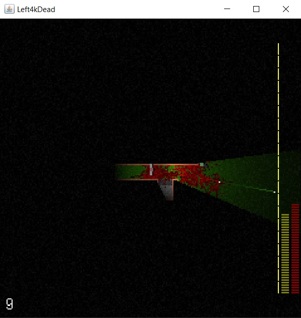

Left 4k Dead as a Swing application. Yep. Original code by Marcus "Notch" Petersson. 

Forked from https://github.com/codingcampbell/Left-4k-Dead/blob/master/G.java

Controls: ASDF for movement, R for reloading, left mouse for shooting

To run, just run the main method in your IDE or use Maven:
1. _mvn clean package_
2. _java -jar target/left4kdead-swing-1.0.0-SNAPSHOT.jar_

Prerequisites:
* Java 1.8 or later (pretty sure this would work with older versions as well)
* Maven 3

Code changes are minimal to show the impressive and incomprehensible code :o) 

My changes:
* Added a Maven project for convenience
* Added a main method
* Wrapped the applet in a Swing frame
* Removed some applet-specific, non-behavior changing code
* Fixed a race condition between Swing and applet code
* Formatted the code a bit with a modern style guide

Remember to give credit to the original author.

Behold:

